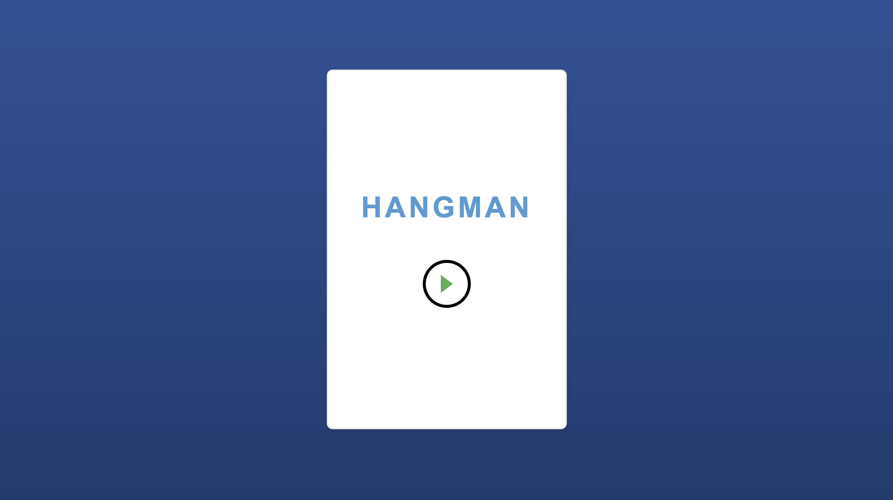
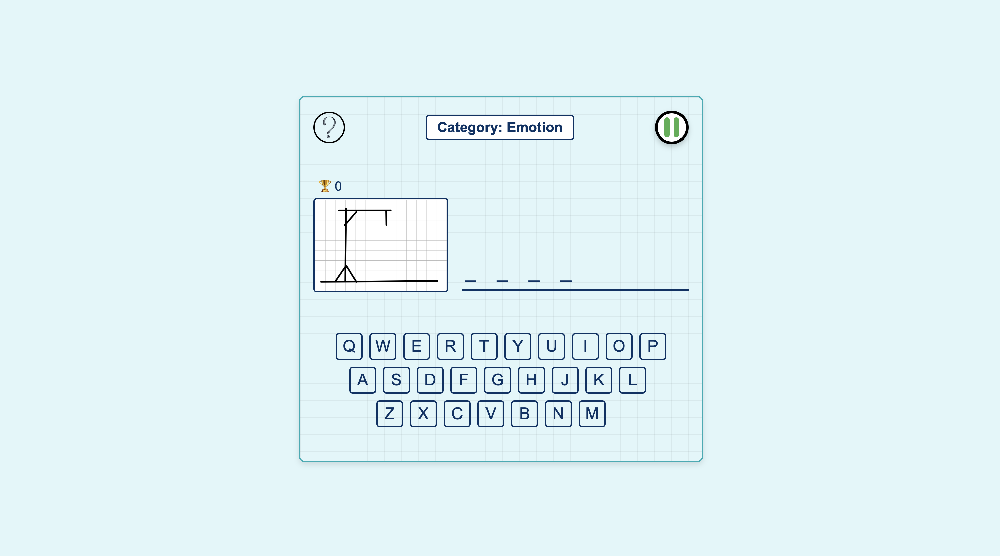

# HangMan
Hangman Game

Description

Hangman is a word-guessing game built with HTML, CSS, and JavaScript. Players attempt to guess a hidden word by selecting letters, with limited attempts before losing. This version includes features like categories, a score system, and a pause menu.

Features

	•	Dynamic Word Categories: Words are grouped into categories like “Body Parts,” “Fruits,” and “Animals.”
	•	Score Tracking: Keeps track of your score and saves it in local storage.
	•	Interactive UI: Includes animations, responsive design, and a virtual keyboard.
	•	Pause and Restart Options: Allows players to pause, restart, or return to the home screen.
	•	How-to-Play Instructions: A popup explaining the game rules.
	•	Responsive Design: Works across various screen sizes.

Deployment Link

[Play Hangman Game](https://hussainworld.github.io/HangMan/)

  Technologies Used

	•	HTML: Structure of the game.
	•	CSS: Styling and layout, including gradients and animations.
	•	JavaScript: Game logic, event handling, and DOM manipulation.

  Files

	1.	index.html: Entry point for the game.
	2.	game.html: Main game interface.
	3.	style.css: Styles for the home page and general layout.
	4.	game.css: Styles specific to the game interface.
	5.	game.js: Handles game logic and interactions.

  Setup Instructions

	1.	Clone the Repository:
  git clone <repository-url>

  	2.	Open the Project:
	•	Open index.html in a web browser to start the game.
	3.	File Structure:
  project/
├── index.html
├── game.html
├── style.css
├── game.css
├── game.js
├── images/
│   ├── hangman1.png
│   ├── hangman2.png
│   ├── hangman3.png
│   ├── ...
│   └── questionMark.png

4.	Dependencies:
	•	No external libraries required; works in modern browsers.

How to Play

	1.	Click the “Play” button on the home screen to start.
	2.	Guess the word by clicking letters on the virtual keyboard.
	•	Correct guesses reveal letters in the word.
	•	Incorrect guesses increase the hangman image progression.
	3.	You have 6 wrong attempts before losing.
	4.	Use the pause menu for options like restarting or returning home.

Key Features in the Code

	•	Dynamic Word Selection:
  const randomWord = words[Math.floor(Math.random() * words.length)];

•	Score Tracking:
function saveScore(score) {
  localStorage.setItem('gameScore', score);
}

	•	Event Handling:
	•	Letter buttons are dynamically disabled after being clicked:
  keyboardButtons.forEach(button => {
    button.addEventListener('click', () => {
        handleKeyPress(button.textContent, button);
    });
});

	•	Responsive UI:
  .game-container {
  width: 400px;
  height: 600px;
  background-color: #ffffff;
  border-radius: 10px;
  box-shadow: 0px 4px 8px rgba(0, 0, 0, 0.1);
}

Future Enhancements

	•	Additional Levels: Add difficulty levels with varying word lengths and attempts.
	•	Multiplayer Mode: Allow two players to compete.
	•	Hint Feature: Provide optional hints for each word.
	•	Background Music: Add a sound feature with adjustable background music.
	•	2-Player Mode: Enable one player to set a word for another player to guess.

Contributing

	1.	Fork the repository.
	2.	Create a feature branch:

  git checkout -b feature/your-feature

  	3.	Commit your changes and push to the branch.
	4.	Submit a pull request.

License

This project is licensed under the MIT License.

Screenshots

